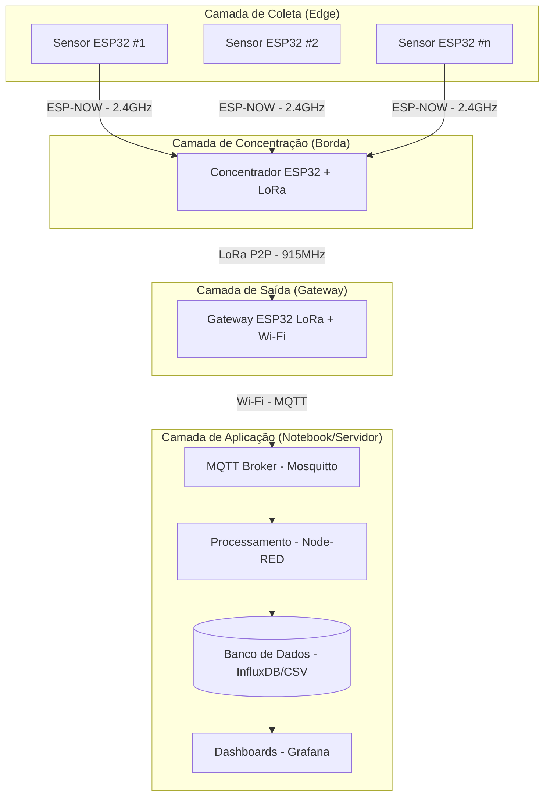

# Diagrama de Ação

## Resumo dos Componentes

### 1. Coletores (Camada de Coleta)
- **Dispositivos:** Sensores baseados em ESP32 (S1, S2... Sn).
- **Função:** Capturam os dados do ambiente (ex: temperatura, umidade do solo) diretamente no ponto de interesse.
- **Comunicação:** Utilizam **ESP-NOW** (protocolo leve e rápido da Espressif) para enviar os dados para o Concentrador.
- **Vantagem:** Baixo consumo de energia e menor custo de hardware, pois não necessitam de módulos LoRa individuais caros, apenas do rádio 2.4GHz nativo do ESP32.

### 2. Concentrador (Camada de Borda)
- **Dispositivo:** ESP32 com módulo LoRa.
- **Função:** Age como um "nó central" no campo. Ele escuta as mensagens de vários sensores próximos via ESP-NOW.
- **Comunicação:** Converte os pacotes recebidos e os retransmite via **LoRa P2P** (915 MHz) para o Gateway.
- **Vantagem:** Permite cobrir grandes distâncias (quilômetros) entre a área de plantio e a base, superando o alcance limitado do ESP-NOW/Wi-Fi.

### 3. Saída / Gateway (Camada de Saída)
- **Dispositivo:** ESP32 com módulo LoRa e conexão Wi-Fi.
- **Função:** É a ponte entre o campo (LoRa) e a infraestrutura de TI (Servidor).
- **Comunicação:** Recebe os dados via LoRa, conecta-se à rede Wi-Fi local e publica as informações via protocolo **MQTT** para o Broker (Mosquitto).
- **Vantagem:** Entrega os dados prontos para serem processados pelo Node-RED e armazenados no InfluxDB.

### 4. Aplicação / Servidor (Camada de Aplicação)
- **Infraestrutura:** Servidor local ou nuvem rodando containers Docker.
- **Componentes:**
  - **Mosquitto:** Broker MQTT que centraliza o recebimento das mensagens vindas do Gateway.
  - **Node-RED:** Realiza o processamento (ETL), formatação e lógica de fluxo para salvar os dados.
  - **InfluxDB:** Banco de dados temporal (Time Series) que armazena o histórico dos sensores de forma otimizada.
  - **Grafana:** Interface visual que conecta ao banco para gerar gráficos e dashboards para tomada de decisão.