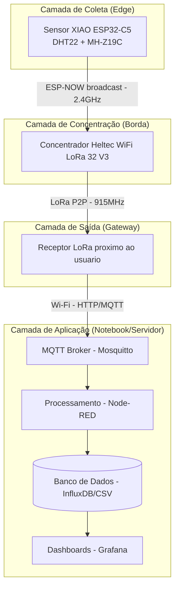

# Diagrama de Ação

```mermaid
graph TD
    subgraph "Camada de Coleta (Edge)"
        S1[Sensor XIAO ESP32-C5<br/>DHT22 + MH-Z19C]
    end

    subgraph "Camada de Concentração (Borda)"
        C[Concentrador Heltec WiFi LoRa 32 V3]
    end

    subgraph "Camada de Saída (Gateway)"
        G[Receptor LoRa proximo ao usuario]
    end

    subgraph "Camada de Aplicação (Notebook/Servidor)"
        B[MQTT Broker - Mosquitto]
        NR[Processamento - Node-RED]
        DB[(Banco de Dados - InfluxDB/CSV)]
        V[Dashboards - Grafana]
    end

    S1 -- "ESP-NOW broadcast - 2.4GHz" --> C
    C -- "LoRa P2P - 915MHz" --> G
    G -- "Wi-Fi - HTTP/MQTT" --> B
    B --> NR
    NR --> DB
    DB --> V
```

## Resumo dos Componentes

### 1. Coletor (Camada de Coleta)
- **Dispositivo:** [Seeed Studio XIAO ESP32-C5](../../Docs/CODEBASE_MEMORY.md) — escolhido por ser compacto e de baixo custo; tem poucos GPIOs, por isso não carrega o rádio LoRa nem o OLED.
- **Firmware:** [`sensor/sensor.ino`](sensor/sensor.ino).
- **Função:** Lê DHT22 (temperatura/umidade) e MH-Z19C (CO2) diretamente no ponto de interesse.
- **Comunicação:** Envia os dados via **ESP-NOW broadcast** (sem necessidade de parear MAC) para o Concentrador.
- **Vantagem:** Baixo consumo de energia e custo de hardware — usa apenas o rádio 2.4GHz nativo do chip, sem ocupar GPIOs adicionais.

### 2. Concentrador (Camada de Borda)
- **Dispositivo:** Heltec WiFi LoRa 32 V3 (ESP32-S3) com módulo LoRa SX1262 integrado.
- **Firmware:** [`sender/concentradorHeltec.ino`](sender/concentradorHeltec.ino).
- **Função:** Recebe via ESP-NOW os pacotes do sensor XIAO ESP32-C5.
- **Comunicação:** Converte os pacotes recebidos e os retransmite via **LoRa P2P** (915 MHz) para o Gateway/receptor, no mesmo formato de payload (`t:..,h:..,co2:..`) usado anteriormente — os receivers não precisaram de alteração.
- **Vantagem:** Permite cobrir grandes distâncias (quilômetros) entre a área de plantio e a base, superando o alcance limitado do ESP-NOW/Wi-Fi.
- **Observação:** [`sender/senderWithSensors.ino`](sender/senderWithSensors.ino) é a versão legada (lê os sensores e envia LoRa no mesmo board, sem o XIAO) — mantida apenas como referência/fallback.

### 3. Saída / Gateway (Camada de Saída)
- **Dispositivo:** ESP32 com módulo LoRa e conexão Wi-Fi.
- **Função:** É a ponte entre o campo (LoRa) e a infraestrutura de TI (Servidor).
- **Comunicação:** Recebe os dados via LoRa, conecta-se à rede Wi-Fi local e publica as informações via protocolo **MQTT** para o Broker (Mosquitto).
- **Vantagem:** Entrega os dados prontos para serem processados pelo Node-RED e armazenados no InfluxDB.

### 4. Aplicação / Servidor (Camada de Aplicação)
- **Infraestrutura:** Servidor local ou nuvem rodando containers Docker.
- **Componentes:**
  - **Mosquitto:** Broker MQTT que centraliza o recebimento das mensagens vindas do Gateway.
  - **Node-RED:** Realiza o processamento (ETL), formatação e lógica de fluxo para salvar os dados.
  - **InfluxDB:** Banco de dados temporal (Time Series) que armazena o histórico dos sensores de forma otimizada.
  - **Grafana:** Interface visual que conecta ao banco para gerar gráficos e dashboards para tomada de decisão.